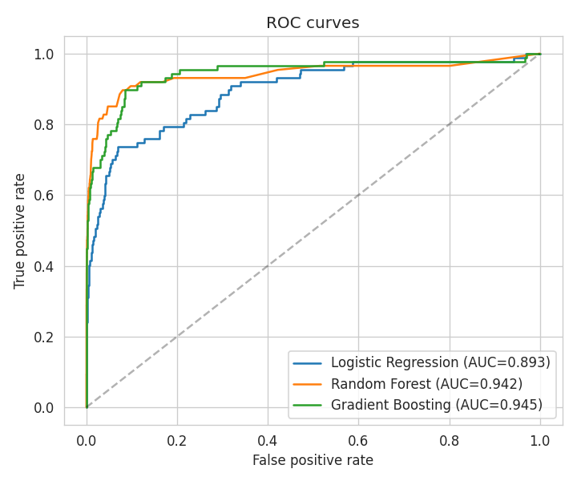

# Credit Card Fraud Detection

An end-to-end machine learning project for detecting fraudulent credit card transactions in a
severely imbalanced dataset (~0.7% fraud rate).

## Overview

This project walks through the full ML pipeline for a binary classification problem under heavy
class imbalance — a common scenario in fraud detection, churn prediction, and rare-event modeling:

1. **EDA** — visualizing class imbalance, transaction amount distributions, and feature correlations
2. **Preprocessing** — stratified train/test split, feature scaling
3. **Imbalance handling** — SMOTE (Synthetic Minority Over-sampling Technique), implemented from scratch
4. **Modeling** — Logistic Regression, Random Forest, and Gradient Boosting classifiers
5. **Evaluation** — Precision, Recall, F1, ROC-AUC, and PR-AUC (the right metrics for imbalanced data)

## Results

| Model | Precision (fraud) | Recall (fraud) | F1 (fraud) | ROC-AUC | PR-AUC |
|---|---|---|---|---|---|
| Logistic Regression | 0.035 | 0.759 | 0.066 | 0.893 | 0.316 |
| **Random Forest** | **0.846** | **0.379** | **0.524** | **0.942** | **0.561** |
| Gradient Boosting | 0.159 | 0.678 | 0.257 | 0.945 | 0.559 |

**Random Forest** delivered the best overall performance (PR-AUC = 0.561), with 84.6% precision
on flagged transactions — minimizing false alarms while still catching a meaningful share of fraud.



## Dataset

This project uses a **synthetically generated** transaction dataset that mirrors the structure of
the well-known [Kaggle Credit Card Fraud Detection dataset](https://www.kaggle.com/mlg-ulb/creditcardfraud)
(28 anonymized PCA-style features, `Amount`, `Time`, and a binary `Class` label), keeping the
project fully reproducible without a large external download.

## How to run

```bash
pip install numpy pandas scikit-learn matplotlib seaborn

python generate_data.py        # creates data/transactions.csv
jupyter notebook fraud_detection.ipynb
```

## Project structure

```
.
├── fraud_detection.ipynb   # Main notebook: EDA, SMOTE, modeling, evaluation
├── generate_data.py        # Generates the synthetic transaction dataset
├── images/                  # Saved plots (EDA, ROC/PR curves, confusion matrix)
└── data/                    # Generated dataset (not tracked in git)
```

## Key takeaways

- Accuracy is a misleading metric for imbalanced classification — a model predicting "legitimate"
  for everything would score ~99% accuracy while catching zero fraud.
- SMOTE significantly improved minority-class recall across all models compared to training on
  raw imbalanced data.
- Random Forest offered the best precision-recall tradeoff for this dataset; Gradient Boosting
  achieved the highest ROC-AUC but with more false positives.

## Possible extensions

- Threshold tuning based on business cost of false positives vs. false negatives
- Hyperparameter tuning via GridSearchCV / RandomizedSearchCV
- XGBoost / LightGBM comparison
- Cost-sensitive evaluation with real monetary impact estimates
